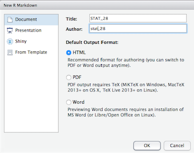
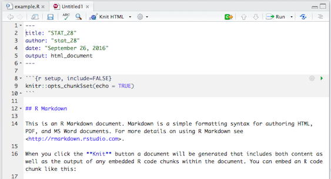

```{r setup, include=FALSE}
knitr::opts_chunk$set(echo = TRUE)
```

# Introduction to RStudio

RStudio is an open-source Integrated Development Environment (IDE) which provides many user-friendly features. We will use RStudio throughout the rest of the course. RStudio can be started from the desktop or through the web server. The user interface is generally the same for the two. We will focus on the web server version and provide a brief section on how to install RStudio locally on your own computer. 

## Web Version

RStudio server can be accessed via a web broswer. All the data storage and computation are done remotely on the server (similar to the web version of ipython notebook that you have experienced in DS 8 and lab 1). 

### Log In

To login in to the server, open the url [https://stat28.berkeley.edu](https://stat28.berkeley.edu/). Once successfully authenticate, you will see the following RStudio interface.


### Your first command in the console

The main window is the "Console" on left panel. The symbol > is a command prompt. And this is where R evaluate your commands. For example, type the following commands in the console:

```{r}
a = 1:5
a
```


R print the outputs (except figures) in the console, right below your commands. You might notice that after you excute the command, vector `a` appears in the upper right `environment` window. In fact, you can always check all the value of objects you created in the `environment` window. Now you may try to explore how to execute commands in the console yourself.

### Create an Rscript to store your commands.

R allows you to go back to previous commands using up and down arrow in your keyboard. However, often times you would like to store R commands in a file. To do so, you can create an R Script by clicking `File` -> `New File` -> `R Script` with the menu bar in the top. R will create an R script with the file extention `.R` and the **editor** window will be invoked. R scripts is a file type that stores only R commands and comments. 

To run one line or several line of code in an R script, put your cursor in that line or select mulitple lines, and then click the `Run` botton.


### RStudio Layout


The RStudio interface contains several component:

- Bottom left: **console** window. This is where you can type simple command after the the prompt ">". R will excute your current command and return the output in this window. 

- Top left: **editor** window. A collection of commands can be edited and saved. This window is hidden on initial startup. You can open it with the menu bar in the top `File` -> `New File` -> `R Script`. The editor supports multiple file type, including R script, R markdown and Sweave files. Similarly, existing files can be opened through `File` -> `Open file ...`. For example, you can open the R script for Lecture 1 `01Probability.R` in lab 2 folder and try to run the code. The red font with `*` at the end of the file name shows that the current changes are not saved. While you are working in a file, you should save it frequently to avoid losing data unexpectedly. 


- Top right: **Environment** / **history** window. In the environment window you can see the data, values and functions you created or loaded. You can view the data by clicking on them. In the example below, if you click the data frame `D` you created, you can see the data on the editor window. The history window shows the commands which has been excuted.


- Bottom right: **files** / **plots** / **packages** / **help** window. 
    + **files**: By double clicking the file name, you can open files, then view and edit them in the editor. You can upload files from your own device to the server by clicking the `Upload` botton. To download files from server, check the box before that file and go to `More` -> `Export`.
    + **plot**: The plots tab will display the graphs. It allows you to go back to pervious plots (by clicking on the left-arrow icon) and export plot as image or pdf. 
    + **packages**: install and load packages.
    + **help**: search and view the help document. 

### Working Directory

Your working directory is the folder on your computer in which you are currently working. When you ask R to open a certain file, it will look in the working directory for this file, and when you tell R to save a data file or figure, it will save it in the working directory. 

Before you start working, please set your working directory to where all your data and script files are or should be stored. You can browse and choose working directory by going to `Session` -> `Set working directory` -> `Choose directory ...` as follows.


### Packages

R can do many statistical and data analyses. They are organized in packages. To get a list of all installed packages, go to the packages window or type `library()` in the console window. If the box in front of the package name is ticked, the package is loaded (activated) and can be used. 

- To install a package. For example, if we want to install a package named `ggplot2`,  click install packages in the packages window and type ggplot to search and install. Or you can type `install.packages("ggplot2")` in the console. 
- To load a package. To use a installed package, you have to load it to you current working environment. You can check box in front of geometry or type library("geometry") in the command window.

### Reading and Saving Files

Similar to Python, R can read/write data files from/to txt or csv. 

```{r}
# Read csv files
twitter_follows <- read.csv("twitter_follows.csv", 
                            stringsAsFactors = FALSE)
# Read txt files, and treat the first row of the txt file as the column names (header)
twitter_follows <- read.table("twitter_follows.txt", 
                              header = TRUE,
                              stringsAsFactors = FALSE)
```

1. What will happen if you set `header to FALSE` or set string?

2. In most cases, we would like to set `stringsAsFactors = FALSE`. `stringsAsFactors = FALSE` tells R to keep character variables as charactor rather than convert to factors. 

```{r}
# Write a data frame to csv
write.csv(twitter_follows, 
          file = "twitter_follows.csv", 
          row.names = FALSE)
# Write a data frame to txt 
write.table(twitter_follows, 
            file = "twitter_follows.txt", 
            row.names = FALSE, 
            quote = FALSE)
```

Questions:

1. What will happen if you set `row.names = TRUE` or `quote = TRUE`?

R provide another method for saving and loading R data. You can save(load) several R objects to(from) `.RData` file at the same time. And load them when you start a new R session in the future. 

```{r}
x <- 1:3
y <- list(a = 1, b = TRUE, c = "oops")
# save x, y
save(x, y, file = "xy.RData")
# load x, y
load("xy.RData")
```

R provides methods to save the environment (all data, values, functions, etc.) in RData for future use. You could excute the code as follows, or click the save botton in the environment window to save and click the `RData` files in the file window to load them. 

```{r}
# save the environment
save.image("~/foo.RData")
# load the environment
load("~/foo.RData")
```


## Desktop Version

The layout looks similar to that of the web version.  The installation of R and RStudio is straightforward, just as installing other applications in your computer. 

- To install R on your computer (legally for free!), go to the home website of R [https://cran.r-project.org/](https://cran.r-project.org/) and choose the platform (Mac, Windows or Linux) corresponds to your own divice.
- After successfully installed R, you can [https://www.rstudio.com/products/rstudio/download3/](https://www.rstudio.com/products/rstudio/download3/) according to your platform. 

# Introduciton to R Markdown

The relationship between R Scipts and R Markdown is similar to the relationship between Python scripts and IPython Notebooks. While R Scipts contains only R code, R Markdown enable us to create dynamic documents with embedded chunks of R code. The document is then converted to other formats such as HTML and PDF which is easy to share. Unlike IPython notebook in which chunks are run and results are printed seperately, R Markdown automatically run all the code by order when generating HTML or PDF files. This feature makes it fully reproducible for others. 

To create an R Markdown file, click on `File` -> `New File` -> `R Markdown`. You should now see a dialog as shown below. Select ‘Document’ in the left panel and fill in title and author field and hit ‘OK’.



You should now have a document which looks like this:



To embed R code into the document, click on the add chunk icon . It should then add a code chunk in the document, you may write code in the chunk as you do in IPython notebooks.


To generate an HTML file, click on the icon . It should generate the HTML in the same folder as the R Markdown file.

The above code chunk will look as follows in the HTML file: 


Similar as in R script file, you can run one or several lines of code from the R Markdown. To run several lines of code, You may select a piece of code as follows:


Then if you click on the `run` icon in the editor window, RStudio will run the code and give the output in the console which look like this:


Similarly, if you would like to run a single line of code. Put the cursor in that line and click `run`.

Please refer to an introduction of [Markdown Basics](http://rmarkdown.rstudio.com/authoring_basics.html) on how to add headers, lists and images on the markdown file. 

# Reference 

- [Getting Started with RStudio, CHAPTER 1, Overview, Installation](http://www.cs.utexas.edu/~cannata/dataVis/Class%20Notes/Getting%20Started%20with%20RStudio.pdf)
- [Torfs, P and Brauer, C. A (very) short introduction to R](https://cran.r-project.org/doc/contrib/Torfs+Brauer-Short-R-Intro.pdf)
- [Oscar Torres-Reyna. Introduction to RStudio](http://dss.princeton.edu/training/RStudio101.pdf)
- [R Mardown tutorial from RStudio](http://rmarkdown.rstudio.com/lesson-1.html)
- [R-Markdown and Knitr Tutorial](https://www.r-bloggers.com/r-markdown-and-knitr-tutorial-part-1/)
